# Проект «Календарь»

Каждый месяц дизайнеры Контура рисуют авторский календарь. Проект начался в декабре 2016 в офисе разработки в Екатеринбурге, на Широкой речке. С 2018 года календари появились во всех офисах.

Подробности о создании календарей — в [статье на Хабре](https://habrahabr.ru/company/skbkontur/blog/348620/).

## Все календари

### Апрель 2019 — Андрей Пушин
[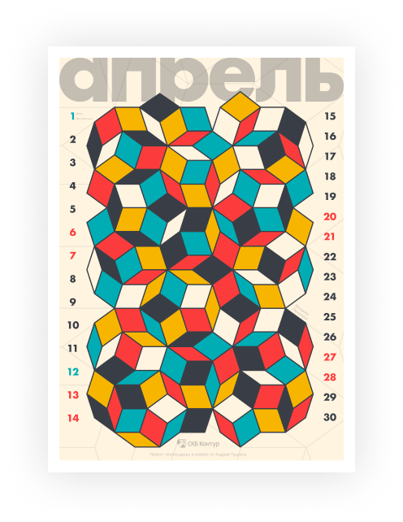](https://drive.google.com/open?id=1qL6YsaR5amUJmHUdz19fWFdT9wVQ7t4B)

> 1 апреля отмечают день математика. Праздник не установлен официально, но существует как традиция. В этот день проходят тематические семинары, лекции, награждения за вклад в развитие науки. У екатеринбургского [МатМеха](https://vk.com/math_mech) празнование «[Дня математика и механика](http://dmm.viharev.com)» вообще растягивается на месяц.
> 
> После окончания МатМеха меня увлек дизайн. Но любовь к математике осталась, в ней есть множество изящных построений и концепций. Эти мысли вдохновили меня сделать что-то в пересечении математики, которую я изучал, и дизайна, которым я занимаюсь.
>
> На календаре часть [мозаики Пенроуза](https://ru.wikipedia.org/wiki/Мозаика_Пенроуза) — непериодического и бесконечного разбиения плоскости. Наборы фигур, которые могут заполнять бесконечную плоскость без пропусков и наложений, а паттерн замощения при этом никогда не повторяется.

### Март 2019 — Никита Беспамятных
[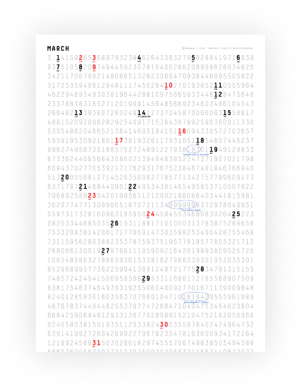](https://drive.google.com/open?id=1mKgdtJpuiiwWZuvY3_1B8IjHovRPGj6O)

> [День числа Пи](https://ru.wikipedia.org/wiki/%D0%94%D0%B5%D0%BD%D1%8C_%D1%87%D0%B8%D1%81%D0%BB%D0%B0_%D0%BF%D0%B8) отмечается 14 марта. Математики в этот день едят пироги и, согласно Википедии, «водят хороводы вокруг предметов, связанных с этим числом», но такого я еще не наблюдал.
> 
> Число Пи примечательно тем, что оно бесконечное и непериодическое, а значит в нем встречается любая последовательность цифр: ваш день рождения, номер паспорта, телефон, любая программа, записанная в виде бинарного представления есть там — только найди и можно запускать. Эту интересную особенность числа я и попытался продемонстрировать. Календарь интерактивный, несколько интересных чисел я выделил для затравки, остальные подпишите вы.

### Февраль 2019 — Наташа Белецкая
[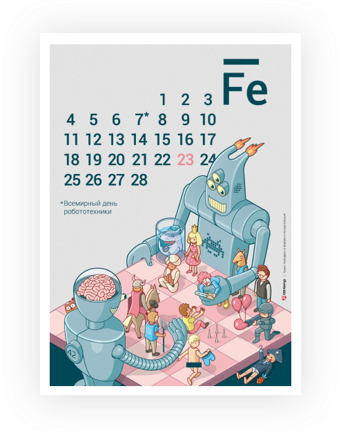](https://drive.google.com/open?id=1gGxvUaPuzOxklaJG5r7qF44IhZPgr-7i)

> Где-то в октябре мне попался на глаза художник [BIG MOUTH](https://www.behance.net/BIGMOUTH), который рисует изометрические иллюстрации. Захотелось попробовать нарисовать что-то в подобной технике. Пару месяцев у меня уже валялся эскиз с роботом, который можно было переработать для календаря, поэтому я решила посмотреть, в каком месяце у железяк профессиональный праздник. Февраль. И как только я об этом узнала, то поняла — это знак, надо рисовать календарь. Правда, в итоге тот эскиз мне не пригодился, но зато стал отправной точкой для нового календаря.

### Январь 2019 — Оксана Галямова
[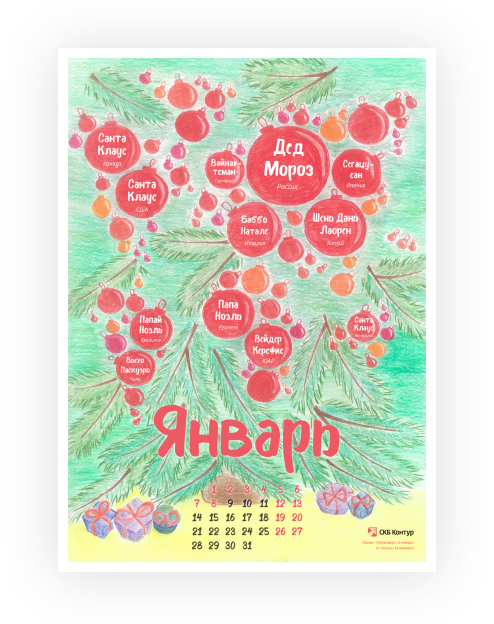](https://drive.google.com/open?id=1CenIKV3rlXrkMaGslyEkBmIjmTb8hwIz)

> В прошлом году я встречала Новый год в Финляндии, а рождество в Эстонии. Удивило, какие необычные названия местных Дед Морозов. В Финляндии: Йоулупукки, в Эстонии: Йылувана. Вот тут я и начала смотреть, как называют главного волшебника зимы в разных странах. Изучила, какие бывают традиции празднования Нового года, названия новогодних персонажей, даже с африканцами на эту тему довелось пообщаться =)
>
>Какими бы разными они не были, у волшебников точно есть одно сходство: в новогоднюю ночь они посещают всех мальчишек и девчонок, чтобы подарить долгожданные подарки! Новых путешествий и волшебства в 2019 году!

### Декабрь 2018 — Мария Кутнякова
[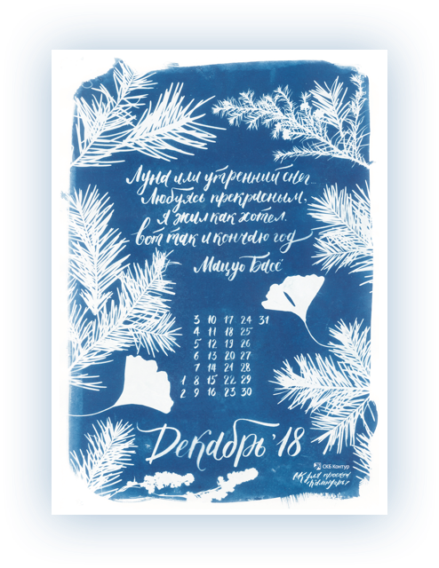](https://drive.google.com/open?id=1lfiYXIpATTsYLel-HiPbNB4bnVK3dcn8)

> О цианотипии (способ цветопечати) я мечтала давно. Несколько лет назад реактивы достать было непросто, но сейчас они стали доступны, и несколько месяцев назад приступила к экспериментам. Идея напечатать календарь уже была, вообще, мне давно хочется сделать цианотипные календарики на каждый месяц из подручных материалов: в мае тюльпаны, в июне сирень, в сентябре рябинка. И потом сверстать из них полный календарь на следующий год.
> 
> Для Контура мне хотелось сделать именно зимнюю картинку, чтобы это было похоже на морозный узор за окном. Стихотворение специально искала у японских поэтов, они мастера в выражении красоты природы. Это примерно 1670е года, представляете. 

### Ноябрь 2018 — Коля Чуприянов
[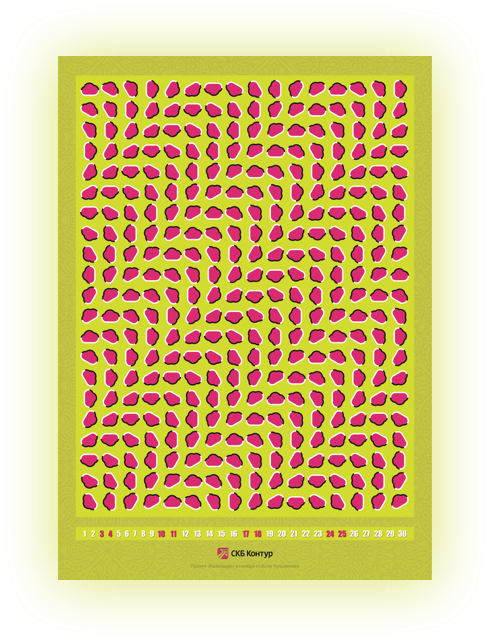](https://drive.google.com/open?id=1y251Kb1f3NEoHbxZ19rq6OWJAvtrie_3)

> Я хотел сделать календарь интерактивным, но таким чтобы не подписываться на группы рассылки или проходить какие-то квесты. Такой аттракцион чистой воды.
> 
> Круче всего было бы сделать календарь-стереограмму (там где нужно косить глаза и потом видеть спрятанную 3D-картинку). Тогда на кухнях были бы очереди из желающих разглядеть что же внутри. А на Стафф писали бы гневные комментарии, что картинку не видно, глаза косить вредно и, вообще, верните календари с арбузами. Но я не успел научиться делать стереограммы достойные контур-календаря, они пока простенькие и плохо разглядываются. Поэтому стереограмма пока ждет своего часа.
> 
> Чтобы не уходить далеко от темы оптических иллюзий, ноябрьский календарь превратился в «плывущие облака Контура». Никакого посыла или мыслей, на которые хотелось бы натолкнуть. Просто плывут облака. Если не плывут — экспериментируйте с дистанцией.

### Октябрь 2018 — Владимир Дзех вместе с Ириной Васькиной, Сашей Мехоношиным, Наташей Трофимовой и Сашей Храмцовым
[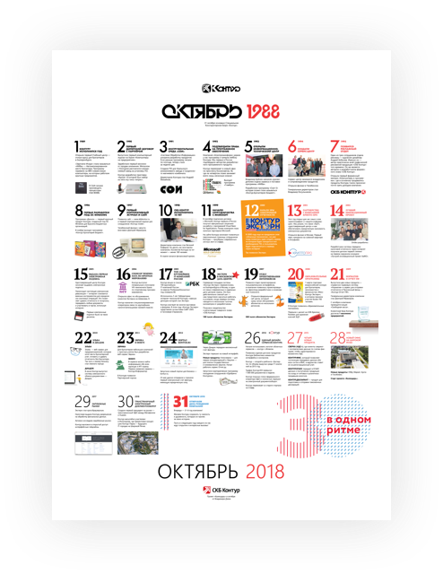](https://drive.google.com/file/d/17dt72_g3K_4cs8j05DLU6ccjjv-7mmwU/view)

> Про что должен быть календарь на месяц, в котором Контуру исполнится 30 лет? Тем более количество лет почти совпадает с количеством дней в календаре. Получился краткий экскурс в историю — 30 лет за 30 дней, и каждый день в календаре — год из жизни компании.

### Сентябрь 2018 — Даша Привалова и Рита Федосеева, идейный вдохновитель Макс Захаров
[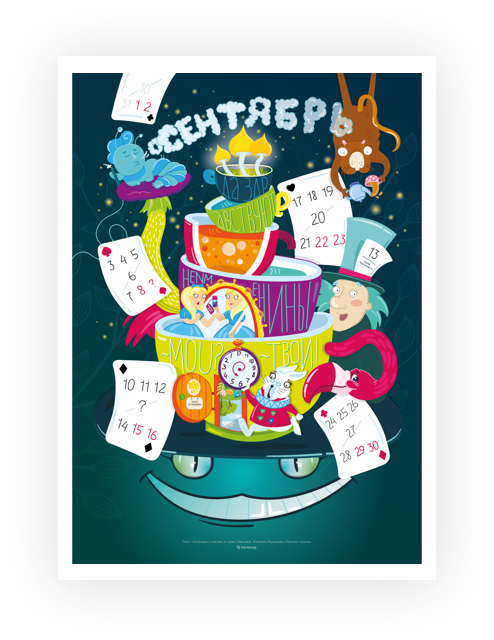](https://drive.google.com/file/d/1XBZVZsA4yhDi_UQ7y0_KgR63nR6neMXj/view)

>Если победить абсурд нельзя, давайте его возглавим! Мы взяли нормальное положение вещей, немного Льюиса Кэрола, хорошенько встряхнули, и у нас получился мир вверх тормашками. Добро пожаловать в сентябрьский календарь абсурда! (Точнее, не добро не пожаловать?)
>
>Присаживайтесь поудобнее, пока милая ондатра наливает вам чай, мы коротко расскажем о правилах. Их нет!
>
>В сентябре мы дважды отмечаем не именины. Какие и когда — не скажем. Но советуем присмотреться: кажется, какие-то цифры пропали с карт? И напоминаем: Льюис Кэрол был математиком, вам эта инфа наверняка поможет. Хотя не факт. А ещё мы спрятали здесь несколько багов (или фич?), уверены, наши внимательные не именинники найдут их быстрее остальных. Мы насчитали 13 фичебагов, а вы?
>
>Можно искать ошибки, а можно не искать, можно открыть календарь и полюбить его смертельно, а можно перевернуть и снова третье сентября. Главное — не оставайтесь равнодушными, вы у себя единственные и достойны лучшего.

### Август 2018 — Наташа Трапезникова и Катя Толстикова
[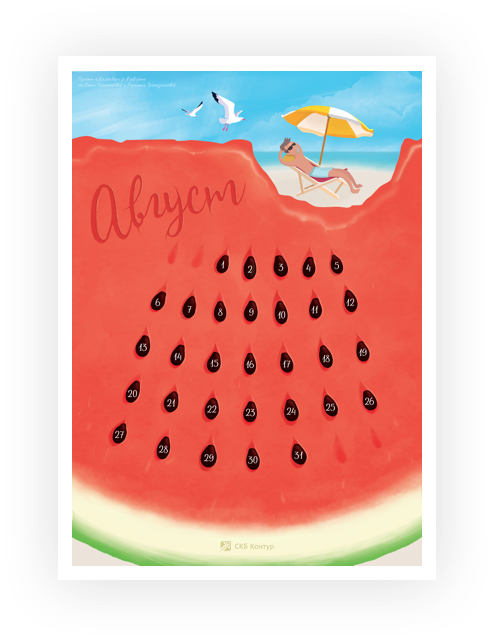](https://drive.google.com/open?id=1GWurFyuxz-N95j4PzidAdtILi3NPfu4Q)

>В августе арбузы становятся слаще, море теплее, а огород радует урожаем. В календаре мы хотели передать это настроение — немного наивное, но такое сладкое :)
>
>Каждый проводит этот месяц по разному, у моря или в огороде, но всех объединяет одно — спелые арбузики!
>
>Надеемся, календарь вдохновит вас на открытие арбузного сезона уже сегодня. И пусть каждый арбуз, который вы купите, будет сладким ;)

### Июнь 2018 — Ирина Шухман

[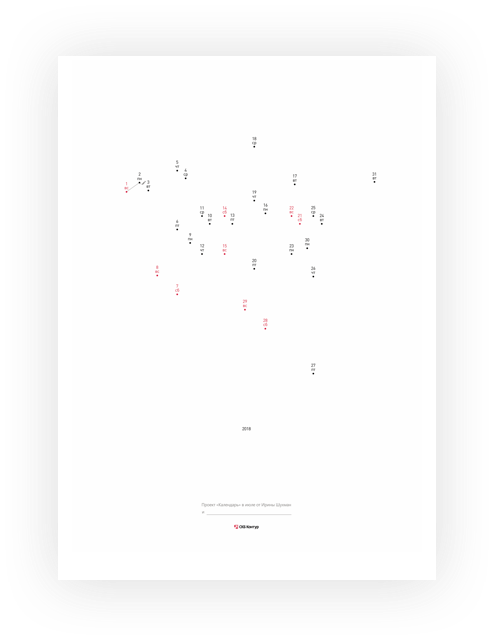](https://drive.google.com/file/d/1xD9bN8piUZg7uUCBK_JW9OsIkOA4UPdH/view?usp=sharing)

>Мне кажется, что времени в будущем в каком-то смысле не существует. Мы не знаем, каким оно будет, пока не проживем его. То есть, мы как бы создаем время, день за днем и у каждого получается по-своему. Именно таким я и сделала календарь. Это заготовка, чтобы сделать свой личный июль.
>
>Для того, чтобы получилась готовая картинка, нужно соединить все точки день за днем. Прямыми линиями, волнистыми или точками, черными линиями или цветными, маркерами или кетчупом — у кого какое настроение.
>
>Будет круто, если авторы потом запостят получившийся календарь. Очень интересно, что получится :)

### Июнь 2018 — Алексей Захаров

[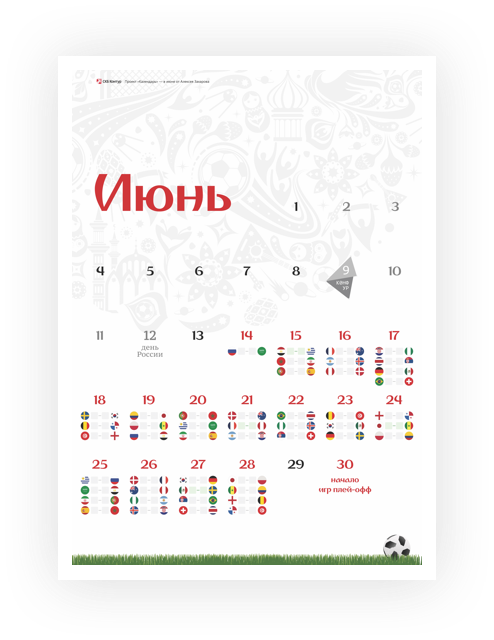](https://drive.google.com/file/d/1gkqilsz7zCoXMU6RS98fPT5x9SN6NnUi/view)

>Июнь 2018 — это долгожданный праздник футбола в России. Открыты новые стадионы, приедут заморские гости, прокачаны тренировочные базы для воспитания отечественных Пеле. Поэтому тема для календаря была очевидна. Сначала хотел нарисовать футбольный матч. 
>
>Но матчей в июне будет много, в них важно, кто победит и выйдет в плей-офф. Отсюда и идея записывать в пустые клеточки счет прошедших матчей, обсуждать и вспоминать топовые моменты. Лайфхак: на календаре слегка выделены матчи, которые проходят на стадионе в Екатеринбурге (цвет настроения зеленый — фирменный для этого города).

### Май 2018 — Иван Перевощиков

[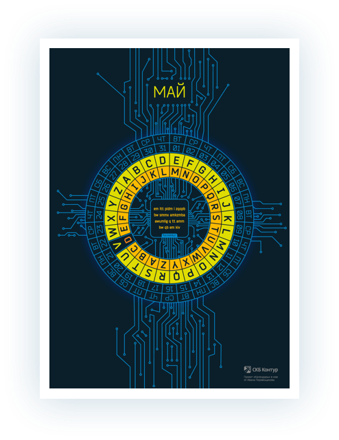](https://drive.google.com/open?id=17kg76i6VCbUUEqz7TWEbU3qmLkcZvWC5)

> Май у меня всегда ассоциировался с праздниками, но хотелось выбрать необычную дату, так и нашелся день шифровальщика. В наше время важно понимать механизмы работы каналов, по которым циркулирует информация. Надеюсь, разгадка послания с календаря пробудит у людей интерес и к современным методам шифрования.

### Апрель 2018 — Мария Шайхутдинова

[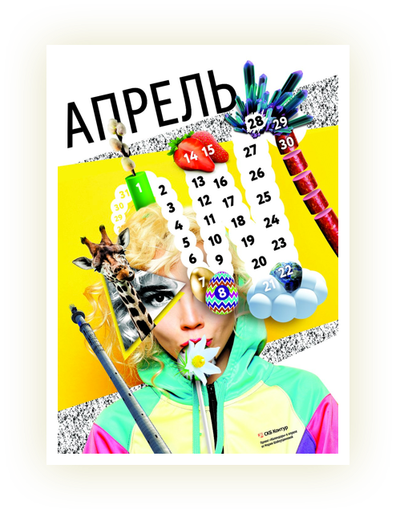](https://drive.google.com/open?id=1q92tu4Z_xBtKckt1ekinAR-i3vRIzkR-)

> Апрель — это время, когда на улице уже как бы весна, но выглядит она на Урале еще совсем не хорошо. Голая земля, только что оголившаяся от снега. Ветки без листьев. Асфальт, грязь и пыль. Но солнце уже светит больше, небо голубое, день длиннее и можно уже снять горнолыжный костюм, а иногда и шапку! И вот под шапкой-то, в голове, и прячется вся весенняя мощь и сила. Всякие бешеные мысли, идеи и планы невидимой колбасой вырастают и рассаживаются по зигзагообразной череде будущих дней.

### Март 2018 — Екатерина Шипулина

[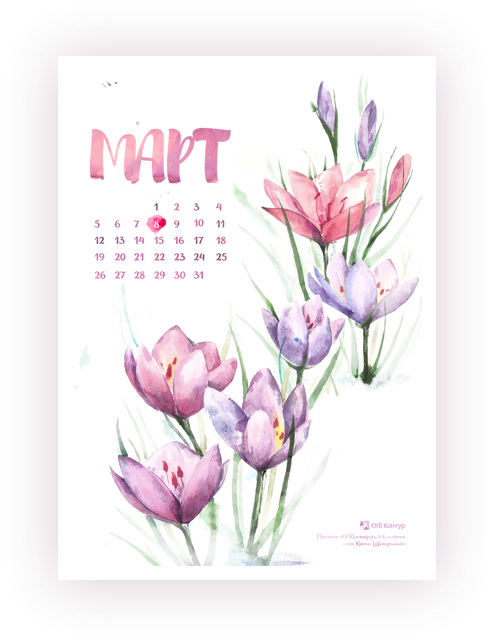](https://drive.google.com/file/d/1Q4JxsFkBgJQ1bT0k7AvoO-UOPUVf-1p4/view)

> Для меня весна — время нежности, смелости и красоты. Поэтому выбор пал на подснежники в акварели. Подснежники пробиваются сквозь снег, несмотря на холод, чтобы показать миру свою первую цветущую красоту. Я хочу чтобы календарь вдохновлял на такую же смелость и нежность.
> 
> Давайте праздновать весну!

### Февраль 2018 — Ксения Возняк

> Когда меня попросили нарисовать календарь на февраль, я подумала, что это же холодно, неприятно и «скорей бы уже весна». Я хотела, чтобы календарь поднимал настроение, вызывал улыбку и согревал :) И тут на помощь пришла она — Масленица. Поэтому всем обнимашки, солнце и блинчики!

### Январь 2018 — Андрей Лукьяненко

> Январь у меня ассоциируется с холодом, оранжевыми закатами и сессией в универе. Когда меня попросили нарисовать календарь на этот месяц, в голове в первую очередь возникла картина про возвращение с экзамена в мороз: общественный транспорт где-то застрял, и чтобы не замерзнуть на остановке, лучше пойти пешком и насладиться драматичным закатом.

### Декабрь 2017 — Александр Храмцов

> По моим наблюдениям, декабрь — самый безумный и суматошный месяц. Кажется, сама жизнь закончится здесь: планы, работа, учеба, возможность купить подарки, спланировать отдых. В декабре многие оглядываются назад, подводят итоги, стараются успеть завершить дела, закрыть бюджеты, исправить оценки. В этот момент, как никогда, ощущается скоротечность и нехватка времени. Легкое безумие предновогодней суеты царит вокруг нас и его сложно игнорировать. Чем ближе к концу декабря, тем сильнее нарастает эмоциональное давление. Где-то там есть предел, когда все закончится. Мой календарь, это обратный отсчет до того самого дня — последнего дня 2017 года.

### Ноябрь 2017 — Юлия Красильникова

> Обычно в ноябре вспоминаю, что надо что-то успеть сделать до конца года: сходить к врачу по ДМС, купить новогодние подарки без очередей. В календаре хотела показать год целиком, чтобы было видно сколько осталось времени. В первой версии был только мой год. Я же не знала, что его можно представить по-другому.

### Октябрь 2017 — Ксения Ильиных и Владимир Кутовой

> Мы решили не просто сделать календарь, а провести месяц осознанности, хороших привычек и любви к себе. На каждый день в календаре есть задание. Мы завели сообщество [во внутренней соцсети], в котором будем публиковать пост с заданием на завтра — что делать и что это дает. Вы получите задание на почту, если вступите в сообщество.

### Сентябрь 2017 — Елена Милованова

> Обнаружила, что в сентябре дни рождения сразу у трех умопомрачительных женщин — Софи Лорен (20е), Бриджит Бардо (28е) и Моника Белуччи (30е). Остановилась все-таки на Лорен и посвятила календарь ей — красотка, классная актриса, эмоциональная и искристая — в общем, люблю ее. На плакате переплелись названия фильмов с ней на итальянском (не все). Это для красоты, конечно :) Посмотрите “Брак по-итальянски” и “Вчера, сегодня, завтра” — прелесть.

### Август 2017 — Яна Мокроносова

*Автор августовского календаря в ответ на вопрос «Что же это?» загадочно улыбается и молчит.*

### Июль 2017 — Екатерина Гордеева

> Идея в том, что июль наступает, и все попадают под его влияние. Даже самые серьёзные и занятые склонны наслаждаться прелестями этого летнего месяца.
> 
> И Бэтмен говорит «July», а не «Июль», не просто так — это может быть название месяца или имя девушки.

### Июнь 2017 — [Контур.Гайды](https://guides.kontur.ru)

> Мне так нравится наш [новый контрол](https://guides.kontur.ru/controls/calendar/), что я решил посвятить ему июньский календарь. И за одним напомнить о дате проведения Конфура (внутренней конференции разработчиков).

### Май 2017 — Дмитрий Астафьев

> Питер Мондриан призывал к «денатурализации» искусства, к отказу от естественных форм и переходу к чистой абстракции. Начиная с 1913 года, картины Мондриана развивались в сторону абстрактных матриц, состоящих из чёрных горизонтальных и вертикальных линий. Оказалось, что это идеальная основа для календарной сетки.

### Апрель 2017 — Мария Кутнякова

> Весна — это такое время года, когда лучше ничему не удивляться. Вот и наш апрельский календарь нарисован по мотивам песни «Умчи меня олень...». И не важно, что в песне поется про осень, главное, что по настроению песня весенняя. Да и оленья страна существует всегда. Иногда даже кажется, что мы в ней живем.

### Март 2017 — Сергей Соловьёв

> «March» в английском языке — это и месяц март, и глагол маршировать, и просто распространенная фамилия. Получилось, что календарь основан на игре слов и смыслов, а стилистика киноафиши лишь добавляет еще одну аллюзию.

### Февраль 2017 — Ольга Коновалова

> Новый календарь поэтичен, но содержателен. Из него вы можете узнать, сколько стоила пролетка при царе. А также убедиться, что грязно в наших городах было всегда.

### Январь 2017 — Владимир Дзех

> Январь в России традиционно полурабочий.

### Декабрь 2016 — Анастасия Молоткова

> Волшебные и новогодние истории в одном месте. Календарь интересно разглядывать, вспоминая любимые фильмы и книги. Например, карточка за 6 число не подписана, ее можно использовать для проверки: кто не узнал — американский шпион.
