# Проект «Календарь»

Каждый месяц дизайнеры Контура рисуют авторский календарь. Проект начался в декабре 2016 в офисе разработки в Екатеринбурге, на Широкой речке. С 2018 года календари появились во всех офисах.

## Все календари

### Февраль 2018 — Ксения Возняк

[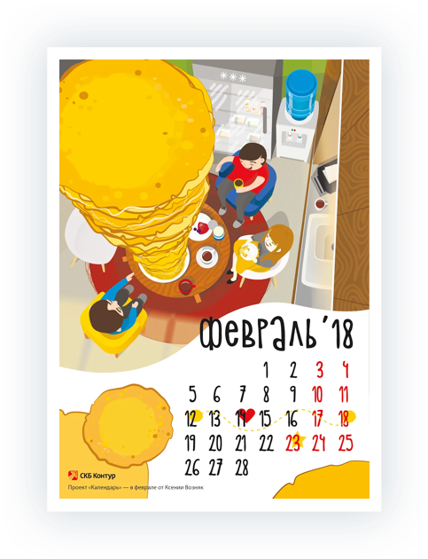](https://drive.google.com/file/d/1LSAMABF5v9LjlSRPyvgi5v7LQUCzQnaT/view)

> Когда меня попросили нарисовать календарь на февраль, я подумала, что это же холодно, неприятно и «скорей бы уже весна». Я хотела, чтобы календарь поднимал настроение, вызывал улыбку и согревал :) И тут на помощь пришла она — Масленица. Поэтому всем обнимашки, солнце и блинчики!

### Январь 2018 — Андрей Лукьяненко

[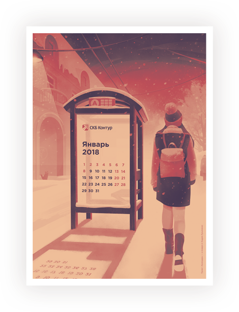](https://drive.google.com/file/d/1IyROXA9rsi_swm8DQWKa2zLx7hPLrtZE/view)

> Январь у меня ассоциируется с холодом, оранжевыми закатами и сессией в универе. Когда меня попросили нарисовать календарь на этот месяц, в голове в первую очередь возникла картина про возвращение с экзамена в мороз: общественный транспорт где-то застрял, и чтобы не замерзнуть на остановке, лучше пойти пешком и насладиться драматичным закатом.

### Декабрь 2017 — Александр Храмцов

[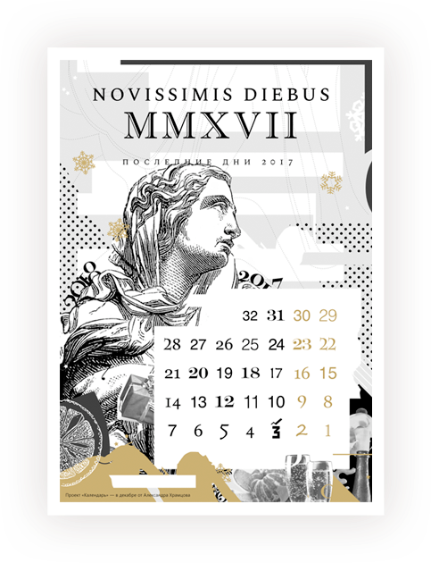](https://drive.google.com/file/d/1Hu4mx9S0ciwVokamDC7_wmDN8SONe0-f/view)

> По моим наблюдениям, декабрь — самый безумный и суматошный месяц. Кажется, сама жизнь закончится здесь: планы, работа, учеба, возможность купить подарки, спланировать отдых. В декабре многие оглядываются назад, подводят итоги, стараются успеть завершить дела, закрыть бюджеты, исправить оценки. В этот момент, как никогда, ощущается скоротечность и нехватка времени. Легкое безумие предновогодней суеты царит вокруг нас и его сложно игнорировать. Чем ближе к концу декабря, тем сильнее нарастает эмоциональное давление. Где-то там есть предел, когда все закончится. Мой календарь, это обратный отсчет до того самого дня — последнего дня 2017 года.

### Ноябрь 2017 — Юлия Красильникова

[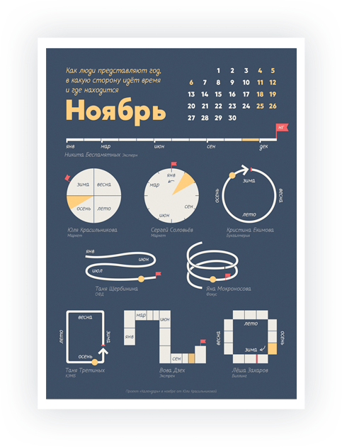](https://drive.google.com/file/d/0Bybt74dksHj8Q0VaWHZyV1Q2Qjg/view)

> Обычно в ноябре вспоминаю, что надо что-то успеть сделать до конца года: сходить к врачу по ДМС, купить новогодние подарки без очередей. В календаре хотела показать год целиком, чтобы было видно сколько осталось времени. В первой версии был только мой год. Я же не знала, что его можно представить по-другому.

### Октябрь 2017 — Ксения Ильиных и Владимир Кутовой

[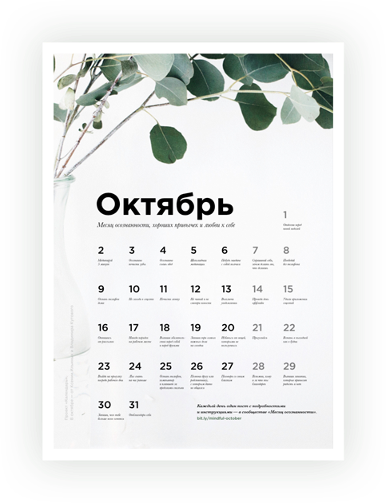](https://drive.google.com/file/d/0Bybt74dksHj8UFlWdzRzT2FPRm8/view)

> Мы решили не просто сделать календарь, а провести месяц осознанности, хороших привычек и любви к себе. На каждый день в календаре есть задание. Мы завели сообщество [во внутренней соцсети], в котором будем публиковать пост с заданием на завтра — что делать и что это дает. Вы получите задание на почту, если вступите в сообщество.

### Сентябрь 2017 — Елена Милованова

[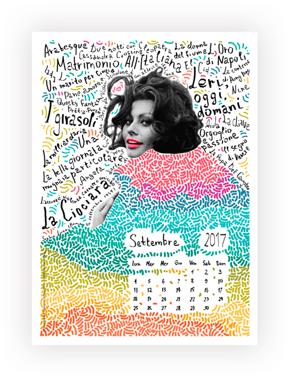](https://drive.google.com/file/d/0Bybt74dksHj8Vkhpd1ZfSk1UNGM/view)

> Обнаружила, что в сентябре дни рождения сразу у трех умопомрачительных женщин — Софи Лорен (20е), Бриджит Бардо (28е) и Моника Белуччи (30е). Остановилась все-таки на Лорен и посвятила календарь ей — красотка, классная актриса, эмоциональная и искристая — в общем, люблю ее. На плакате переплелись названия фильмов с ней на итальянском (не все). Это для красоты, конечно :) Посмотрите “Брак по-итальянски” и “Вчера, сегодня, завтра” — прелесть.

### Август 2017 — Яна Мокроносова

[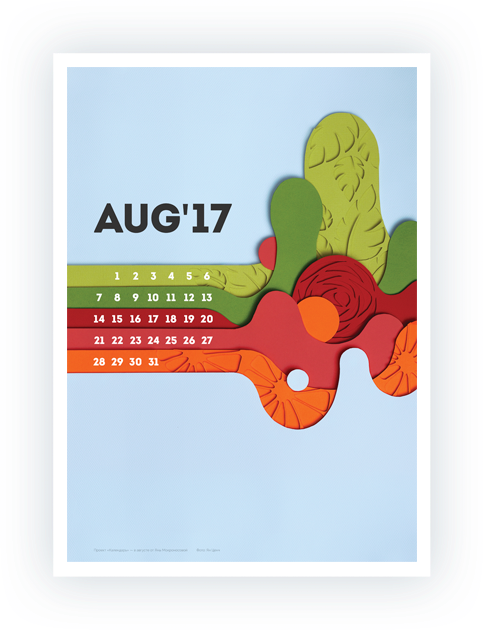](https://drive.google.com/file/d/0Bybt74dksHj8aUtkcDNrX3htTmM/view)

*Автор августовского календаря в ответ на вопрос «Что же это?» загадочно улыбается и молчит.*

### Июль 2017 — Екатерина Гордеева

[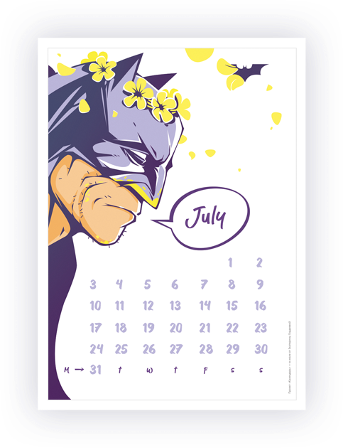](https://drive.google.com/file/d/0Bybt74dksHj8djJxSFZXVENxaE0/view)

> Идея в том, что июль наступает, и все попадают под его влияние. Даже самые серьёзные и занятые склонны наслаждаться прелестями этого летнего месяца.
> 
> И Бэтмен говорит «July», а не «Июль», не просто так — это может быть название месяца или имя девушки.

### Июнь 2017 — [Контур.Гайды](https://guides.kontur.ru)

[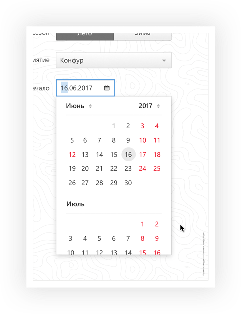](https://drive.google.com/file/d/0Bybt74dksHj8d3I5NG85d0xkVnc/view)

> Мне так нравится наш [новый контрол](https://guides.kontur.ru/controls/calendar/), что я решил посвятить ему июньский календарь. И за одним напомнить о дате проведения Конфура.

### Май 2017 — Дмитрий Астафьев

[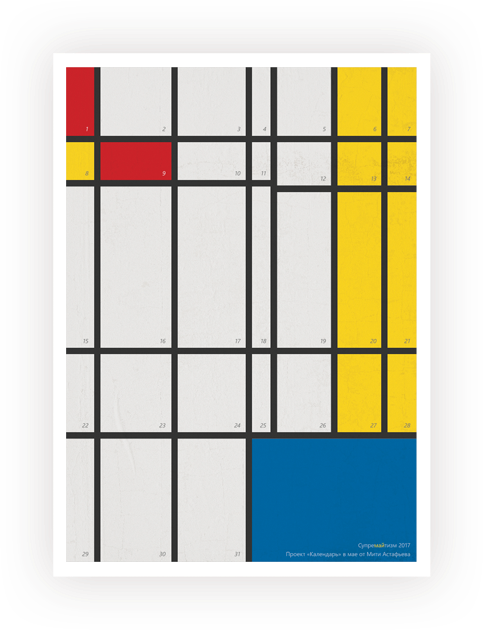](https://drive.google.com/file/d/0Bybt74dksHj8ZDhyOEN2dW1wRkU/view)

> Питер Мондриан призывал к «денатурализации» искусства, к отказу от естественных форм и переходу к чистой абстракции. Начиная с 1913 года, картины Мондриана развивались в сторону абстрактных матриц, состоящих из чёрных горизонтальных и вертикальных линий. Оказалось, что это идеальная основа для календарной сетки.

### Апрель 2017 — Мария Кутнякова

[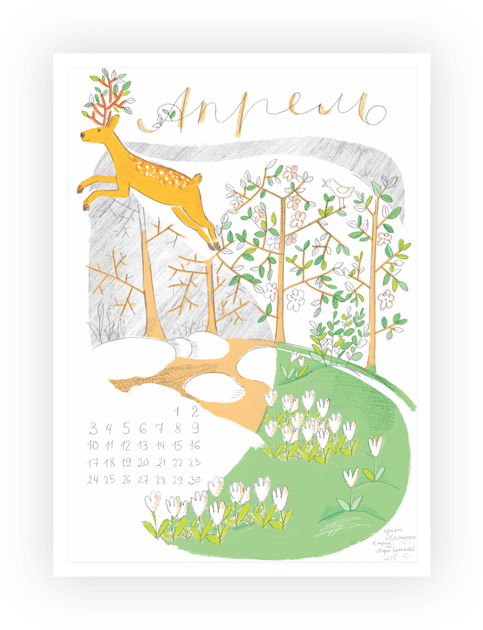](https://drive.google.com/file/d/0Bybt74dksHj8TzFYTHNFSHlodlE/view)

> Весна — это такое время года, когда лучше ничему не удивляться. Вот и наш апрельский календарь нарисован по мотивам песни «Умчи меня олень...». И не важно, что в песне поется про осень, главное, что по настроению песня весенняя. Да и оленья страна существует всегда. Иногда даже кажется, что мы в ней живем.

### Март 2017 — Сергей Соловьёв

> «March» в английском языке — это и месяц март, и глагол маршировать, и просто распространенная фамилия. Получилось, что календарь основан на игре слов и смыслов, а стилистика киноафиши лишь добавляет еще одну аллюзию.

### Февраль 2017 — Ольга Коновалова

[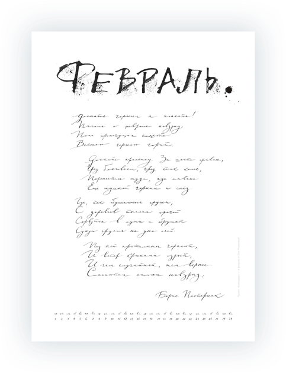](https://drive.google.com/file/d/0Bybt74dksHj8MFh4VVI2RWhNSTg/view)

> Новый календарь поэтичен, но содержателен. Из него вы можете узнать, сколько стоила пролетка при царе. А также убедиться, что грязно в наших городах было всегда.

### Январь 2017 — Владимир Дзех

[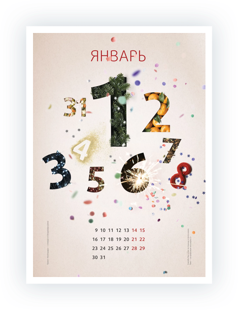](https://drive.google.com/file/d/0Bybt74dksHj8OHlEdkNTVG5Odmc/view)

> Январь в России традиционно полурабочий.

### Декабрь 2016 — Анастасия Молоткова

[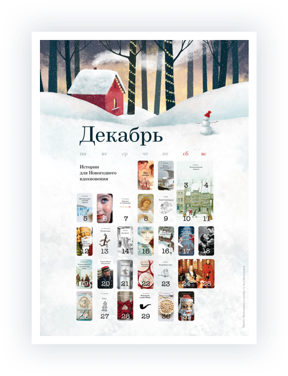](images/2016.12.jpg)

> Волшебные и новогодние истории в одном месте. Календарь интересно разглядывать, вспоминая любимые фильмы и книги. Например, карточка за 6 число не подписана, ее можно использовать для проверки: кто не узнал — американский шпион.